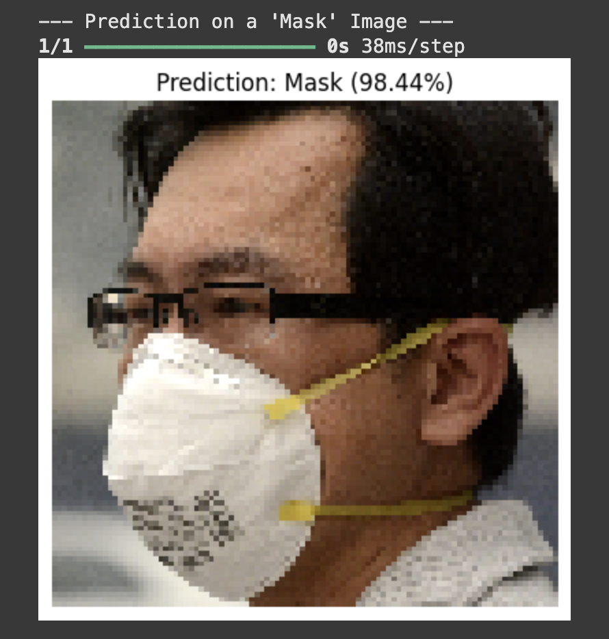

# Face Mask Detection with AlexNet

This project is a deep learning application built to classify whether a person in an image is wearing a face mask or not. The core of the project is a Convolutional Neural Network (CNN) based on the classic **AlexNet architecture**, trained on a public dataset of face mask images.

The entire workflow, from data analysis to model training and evaluation, is contained within a single, end-to-end Google Colab notebook.

### Final Prediction Examples

 

### Project Workflow & Features

This project follows a complete machine learning pipeline:

1.  **Exploratory Data Analysis (EDA):** The notebook begins by analyzing the dataset to understand the class distribution (Mask vs. No Mask) and visualizes sample images from each category.

2.  **Data Augmentation:** To improve model generalization and prevent overfitting, `ImageDataGenerator` is used to create modified versions of the training images by applying random rotations, zooms, shifts, and flips. The results of this process are also visualized.

3.  **Model Architecture:** A CNN inspired by the groundbreaking **AlexNet** architecture is built from scratch using TensorFlow and Keras. It consists of 5 convolutional layers and 3 fully-connected layers.

4.  **Model Training:** The model is trained on the augmented image data. The process was debugged to solve common training issues like non-convergence by fine-tuning the `Adam` optimizer's learning rate.

5.  **Performance Visualization:** The training and validation accuracy/loss are plotted over epochs to visually assess the learning process.

6.  **Comprehensive Evaluation:** The model's performance is rigorously evaluated on the validation set using a **Classification Report** (showing precision, recall, F1-score) and a **Confusion Matrix**.

### Technologies Used

* **Backend & ML Framework:** Python, TensorFlow, Keras

* **Data Analysis & Utilities:** NumPy, Scikit-learn

* **Data Visualization:** Matplotlib, Seaborn

* **Image Processing:** OpenCV, Pillow (PIL)

* **Development Environment:** Google Colaboratory

### How to Run This Project

This project is designed to be fully reproducible in a cloud environment.

1.  **Clone the Repository (or download the notebook):**
    Get the `.ipynb` file on your local machine.

2.  **Upload to Google Drive:**

    * Upload the `Face_Mask_Detection_Alexnet.ipynb` notebook to your Google Drive.

    * Upload the `Face_mask_dataset.zip` file to the main "My Drive" directory.

3.  **Open in Google Colab:**

    * Right-click on the notebook file in Google Drive and select "Open with" -> "Google Colaboratory".

    * Ensure you are using a GPU-accelerated runtime for faster training by navigating to **Runtime -> Change runtime type -> Hardware accelerator -> GPU**.

4.  **Run the Notebook:**

    * Execute the cells in order from top to bottom.

    * The first cell will ask for permission to mount your Google Drive to access the dataset.

    * The notebook will then handle the rest, from unzipping the data to training the model and showing the final evaluation metrics.
